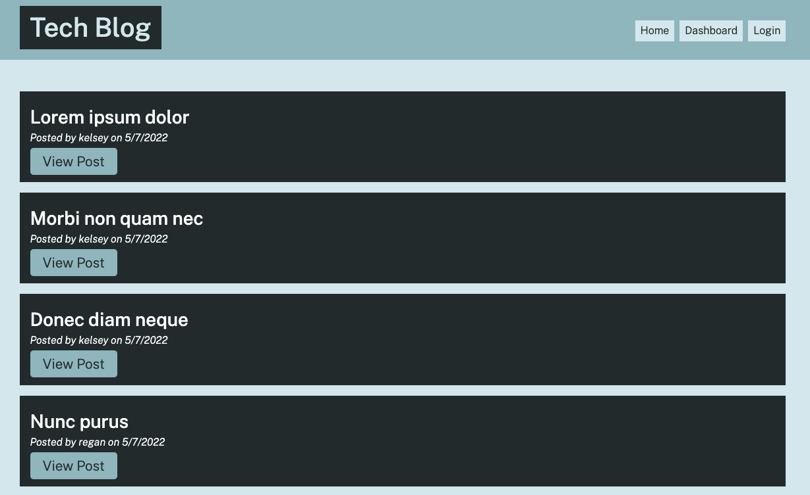
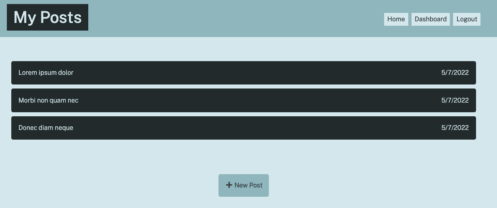

# Tech Blog

## Description

A CMS-style blog site where developers can publish their blog posts and comment on other developers’ posts as well. The app follows the MVC paradigm in its architectural structure, using Handlebars.js as the templating language, Sequelize as the ORM, and the express-session npm package for authentication.

## Built With

- JavaScript
- Node.js
- Express.js
- MySQL2
- Sequelize
- dotenv
- bcrypt
- Handlebars
- CSS
- Heroku

## Website

https://quiet-chamber-59067.herokuapp.com/

## Preview

## Contribution

Made with ❤️ by Kelsey Alderman
